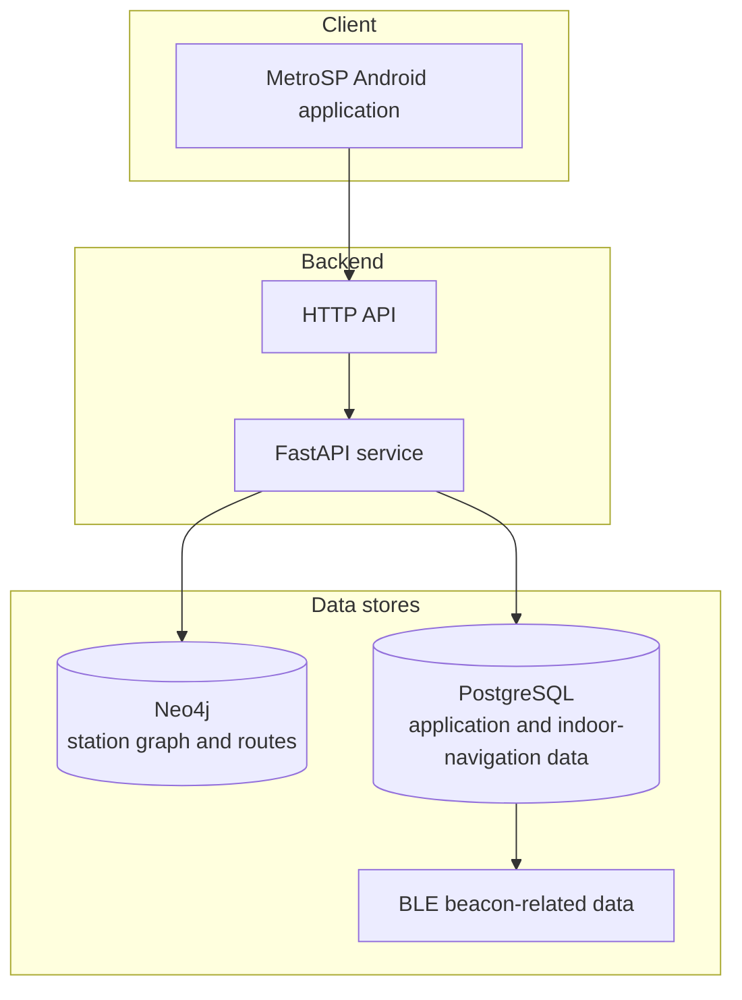

> **Archived:** This repository is a historical academic artifact and is no longer actively maintained. It is public for reference only and is published without an open-source license. Public availability should not be interpreted as permission to use, modify, or redistribute the material.

[**Leia-me em Português**](README.pt-br.md)

# MetroSP

MetroSP is the FastAPI backend for a route-planning and indoor-navigation system for the Sao Paulo Metro network. It combines a Neo4j station graph, PostgreSQL application data, and BLE beacon information for use by the [MetroSP Android application](https://github.com/Bollos00/MetroSP_AndroidApp).

## System overview

The backend provides the service layer between the Android client and the project's data stores:



The [TCC repository](https://github.com/Bollos00/TCC) contains the complete thesis, diagrams, presentations, and supporting material for the complete system. The [system topology diagram](https://github.com/Bollos00/TCC/blob/main/monografia/Imagens/topologia_sistema_diagrama.drawio.pdf) provides a visual description of the main components on the system.

## Main capabilities

- Calculate routes between Metro stations through the station graph.
- Expose the planner graph used by the client.
- Register and authenticate application users with UUID-based identifiers.
- Receive user node data used by the route-planning update process.
- Provide indoor-navigation data for selected stations.
- Periodically update graph link information from collected node data.

## Local deployment

### Prerequisites

- Docker with Docker Compose support.
- Credentials to access to the database configuration expected by the files under `app/metro_neo4j/` and `app/metro_sql/`.

### Local Compose caveat

The [`docker-compose.yml`](docker-compose.yml) contains the `endpoints` block intended for deployment on [Okteto](https://www.okteto.com/). For a local Docker Compose run, comment out that block.

### Start the services

From the repository root, run:

```bash
docker compose up --build
```

The services expose these local ports:

| Service | Port | Purpose |
| --- | ---: | --- |
| FastAPI | `8080` | API and interactive documentation |
| Neo4j HTTP | `7474` | Neo4j browser |
| Neo4j Bolt | `7687` | Application database connection |
| PostgreSQL | `5432` | Relational database connection |
| pgAdmin | `5050` | PostgreSQL administration interface |

Once the API is running, open [http://localhost:8080/docs](http://localhost:8080/docs) to inspect its OpenAPI documentation.

## API surface

The API endpoints are:

| Method | Endpoint | Purpose |
| --- | --- | --- |
| `GET` | `/` | Redirect to  `docs` (the API documentation) |
| `GET` | `/planner` | Calculate a route between two stations |
| `GET` | `/get_planner_graph` | Return the planner graph |
| `POST` | `/create_user` | Create a user |
| `POST` | `/delete_user` | Delete an authenticated user |
| `POST` | `/create_nodes` | Submit authenticated user node data |
| `GET` | `/valid_uuids` | Return valid user UUIDs |
| `GET` | `/get_indoor_nav_info` | Return indoor-navigation data for stations |

Use the generated `/docs` page as reference.

## Project structure

- [`app/main.py`](app/main.py) - FastAPI application entry point and lifecycle initialization.
- [`app/route_planner/`](app/route_planner/) - Route calculation and graph-link update logic.
- [`app/metro_neo4j/`](app/metro_neo4j/) - Neo4j integration for the Metro station graph.
- [`app/metro_sql/`](app/metro_sql/) - PostgreSQL models, schemas, and database helpers.
- [`app/indoor_nav/`](app/indoor_nav/) - Indoor-navigation station data.
- [`app/metro_timezone/`](app/metro_timezone/) - Sao Paulo timezone utilities.
- [`app/requirements.txt`](app/requirements.txt) - Python dependencies.
- [`app/Dockerfile`](app/Dockerfile) - Container image definition.
- [`tests/client_test.py`](tests/client_test.py) - Integration-oriented API client test script.

## Testing

The client test expects a running backend. From the repository root, run:

```bash
python tests/client_test.py
```

## Related repositories

- [MetroSP_AndroidApp](https://github.com/Bollos00/MetroSP_AndroidApp) - Android client application.
- [TCC](https://github.com/Bollos00/TCC) - Thesis, presentations, diagrams, and project documentation.
