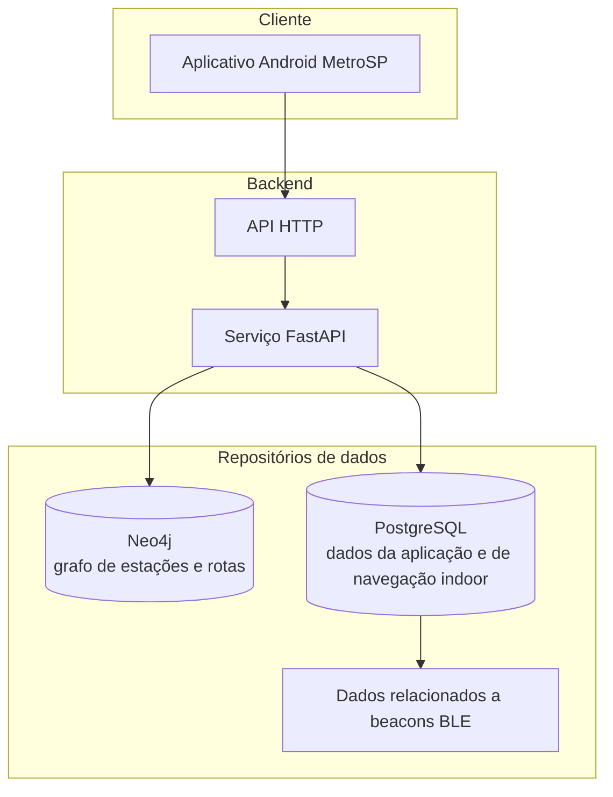

> **Arquivado:** Este repositório é um artefato acadêmico histórico e não é mais mantido ativamente. Ele está disponível publicamente apenas para referência e foi publicado sem uma licença de código aberto. A disponibilidade pública não deve ser interpretada como permissão para usar, modificar ou redistribuir o material.

# MetroSP

MetroSP é o backend baseado em FastAPI de um sistema de planejamento de rotas e navegação indoor para a rede do Metrô de São Paulo. Ele combina um grafo de estações Neo4j, dados da aplicação em PostgreSQL e informações de beacons BLE para uso pelo [aplicativo Android MetroSP](https://github.com/Bollos00/MetroSP_AndroidApp).

## Visão geral do sistema

O backend fornece a camada de serviço entre o cliente Android e os os bancos de dados do projeto:



O [repositório TCC](https://github.com/Bollos00/TCC) contém a monografia completa, diagramas, apresentações e materiais de apoio de todo o sistema. O [diagrama de topologia do sistema](https://github.com/Bollos00/TCC/blob/main/monografia/Imagens/topologia_sistema_diagrama.drawio.pdf) apresenta uma descrição visual dos principais componentes do sistema.

## Principais funcionalidades

- Calcular rotas entre estações do Metrô por meio do grafo de estações.
- Expor o grafo do planejador usado pelo cliente.
- Cadastrar e autenticar usuários da aplicação com identificadores baseados em UUID.
- Receber dados de nós dos usuários usados pelo processo de atualização do planejamento de rotas.
- Fornecer dados de navegação indoor para estações selecionadas.
- Atualizar periodicamente as informações das ligações do grafo a partir dos dados de nós coletados.

## Implantação local

### Pré-requisitos

- Docker com suporte ao Docker Compose.
- Credenciais para acessar a configuração dos bancos de dados esperada pelos arquivos em `app/metro_neo4j/` e `app/metro_sql/`.

### Observação sobre o Compose local

O [`docker-compose.yml`](docker-compose.yml) contém o bloco `endpoints`, destinado à implantação no [Okteto](https://www.okteto.com/). Para executar o Docker Compose localmente, comente esse bloco.

### Iniciar os serviços

Na raiz do repositório, execute:

```bash
docker compose up --build
```

Os serviços expõem as seguintes portas locais:

| Serviço | Porta | Finalidade |
| --- | ---: | --- |
| FastAPI | `8080` | API e documentação interativa |
| Neo4j HTTP | `7474` | Navegador do Neo4j |
| Neo4j Bolt | `7687` | Conexão com o banco de dados da aplicação |
| PostgreSQL | `5432` | Conexão com o banco de dados relacional |
| pgAdmin | `5050` | Interface de administração do PostgreSQL |

Quando a API estiver em execução, abra [http://localhost:8080/docs](http://localhost:8080/docs) para consultar sua documentação OpenAPI.

## Endpoints da API

Os endpoints da API são:

| Método | Endpoint | Finalidade |
| --- | --- | --- |
| `GET` | `/` | Redireciona para `docs` (a documentação da API) |
| `GET` | `/planner` | Calcula uma rota entre duas estações |
| `GET` | `/get_planner_graph` | Retorna o grafo do planejador |
| `POST` | `/create_user` | Cria um usuário |
| `POST` | `/delete_user` | Exclui um usuário autenticado |
| `POST` | `/create_nodes` | Envia dados de nós de um usuário autenticado |
| `GET` | `/valid_uuids` | Retorna UUIDs de usuários válidos |
| `GET` | `/get_indoor_nav_info` | Retorna dados de navegação indoor para as estações |

Use a página `/docs` gerada pela aplicação como referência.

## Estrutura do projeto

- [`app/main.py`](app/main.py) - Ponto de entrada da aplicação FastAPI e inicialização do ciclo de vida.
- [`app/route_planner/`](app/route_planner/) - Lógica de cálculo de rotas e atualização das ligações do grafo.
- [`app/metro_neo4j/`](app/metro_neo4j/) - Integração com o Neo4j para o grafo de estações do Metrô.
- [`app/metro_sql/`](app/metro_sql/) - Modelos, schemas e helpers do PostgreSQL.
- [`app/indoor_nav/`](app/indoor_nav/) - Dados das estações para navegação indoor.
- [`app/metro_timezone/`](app/metro_timezone/) - Utilitários de fuso horário de São Paulo.
- [`app/requirements.txt`](app/requirements.txt) - Dependências do Python.
- [`app/Dockerfile`](app/Dockerfile) - Definição da imagem do contêiner.
- [`tests/client_test.py`](tests/client_test.py) - Script de teste de cliente orientado à integração.

## Testes

O teste do cliente espera que o backend esteja em execução. Na raiz do repositório, execute:

```bash
python tests/client_test.py
```

## Repositórios relacionados

- [MetroSP_AndroidApp](https://github.com/Bollos00/MetroSP_AndroidApp) - Aplicativo cliente Android.
- [TCC](https://github.com/Bollos00/TCC) - Monografia, apresentações, diagramas e documentação do projeto.
